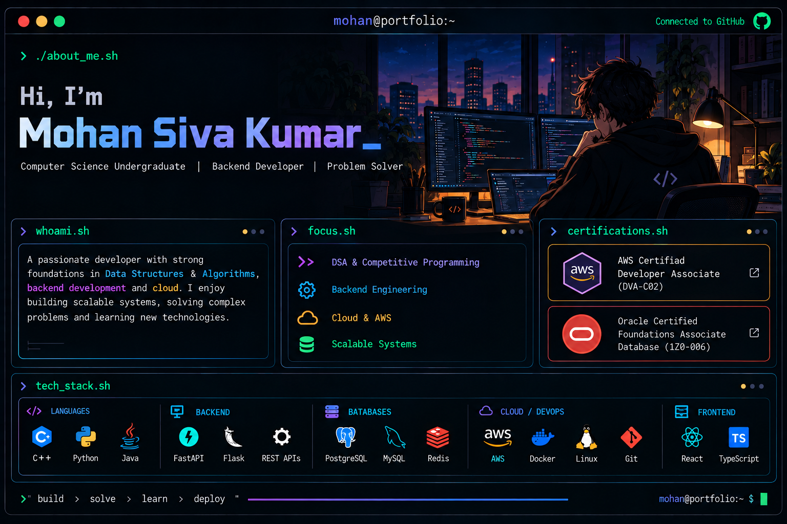

<div align="center">



<br><br>


<br>

<a href="https://www.linkedin.com/in/mohan-siva-kumar-magapati-6430a1291">

</a>
<a href="https://leetcode.com/Mohansivakumar17">

</a>
<a href="mailto:magapatimohan@gmail.com">

</a>
<a href="#certifications">

</a>

</div>

---

## 🟢 `mohan@dev:~$ whoami`

<table>
<tr>
<td width="52%" valign="top">

### 🟢 Identity

| | |
|---|---|
| **NAME** | `Mohan Siva Kumar Magapati` |
| **ROLE** | `Backend Engineer · Cloud Enthusiast` |
| **SPECIALTY** | `FastAPI · AWS · PostgreSQL · Redis` |
| **EDUCATION** | `B.Tech CSE (Data Science)` |
| **COLLEGE** | `Aditya College of Engineering` |
| **BATCH** | `2023 — 2027` |

</td>
<td width="48%" valign="top">

### 🔵 Runtime

```text
mohan@dev:~$ status

● ONLINE
● BUILDING
● LEARNING
● DEPLOYING
```

**LeetCode**

`Knight Badge · Peak Rating: 1988`

**Email**

`magapatimohan@gmail.com`

</td>
</tr>
</table>

> 🟢 **MISSION** — Build scalable backend systems, design cloud-native infrastructure, and solve hard problems one commit at a time.

---

## ⚡ Tech Stack

<div align="center">

### Languages


### Backend · APIs · Databases


### Cloud · DevOps · Infrastructure


</div>

---

## 💻 `mohan@dev:~$ cat competitive_programming.log`

<div align="center">


<br><br>

| Platform | Achievement |
|:---:|:---:|
| 🟠 **LeetCode** | ⚔️ Knight Badge · Peak Rating 1988 · 750+ Solved |
| 🥇 **Oracle Academy × Aditya University** | 4th / 1,500+ Participants — 4-Day SQL Competition |
| 🟢 **HackerRank** | 18 Stars |
| 🔵 **CodeChef** | 2 Star |

</div>

---

<div id="certifications"></div>

## 🏆 `mohan@dev:~$ cat certifications.log`

<div align="center">

| Status | Certification |
|:---:|---|
| 🟢 `OK` | **AWS Certified Developer – Associate (DVA-C02)** |
| 🟢 `OK` | **Oracle Certified Foundations Associate — Java** |
| 🟢 `OK` | **Oracle Certified Foundations Associate — Database** |

<br>


</div>

---

## 💼 `mohan@dev:~$ cat experience.log`

### `Software Development Intern — Technical Hub`

```text
● Built CI/CD pipelines with GitHub Actions and AWS CodePipeline
● Containerized applications using Docker
● Deployed on AWS EC2 & S3, monitored with CloudWatch
● Automated dev workflows using Python and Bash
```

---

<div align="center">

## `mohan@dev:~$ ./build-future.sh`

```text
[████████████████████████████████████████] 100%

✓ Backend Engineering (FastAPI · Flask · PostgreSQL · Redis)
✓ Cloud Infrastructure (AWS EC2 · S3 · Lambda · SNS)
✓ DevOps & Automation (Docker · GitHub Actions · CI/CD)
✓ Competitive Programming (Knight · 1988 · 750+)
✓ System Design (Clean Architecture · RBAC · JWT)

BUILD SUCCESSFUL

mohan@dev:~$ _
```

<br>

**Building Scalable Systems · One Commit at a Time ☁**


</div>
